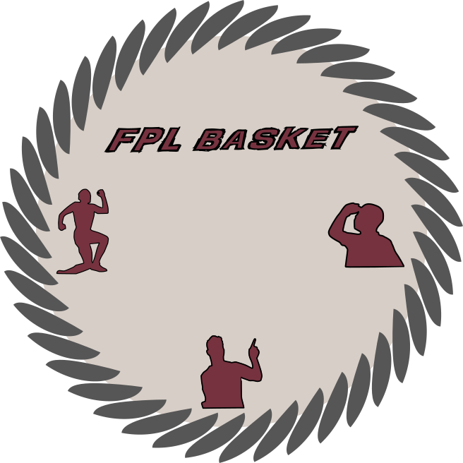

# FPL Basket

FPL Basket is a web application for [Fantasy Premier League (FPL)](https://fantasy.premierleague.com) managers to analyze league performance, track player statistics, and gain insights about their mini-leagues.

## Features

- View comprehensive statistics for your mini-league
- Compare managers' performance across gameweeks
- Track live player performance during gameweeks
- Visualize team selections and transfers
- Analyze points distribution among positions and players

## Project Structure

The project is split into two main components:

- **Server**: Backend API built with Express.js and TypeScript
- **Web**: Frontend application built with React, TypeScript, and Material-UI

### Prerequisites

- Node.js (v18 or later)
- pnpm

## License

This project is licensed under the MIT License.

## Acknowledgments

- [Fantasy Premier League API](https://fantasy.premierleague.com/api/bootstrap-static/) for providing the data
- All FPL managers who use this tool
